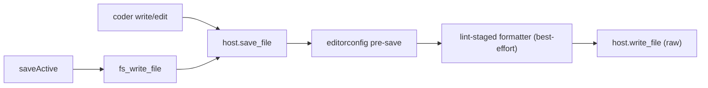

# ADR 0012 — Format on save via lint-staged

Date: 2026-05-05
Status: accepted

## Context

Phase 1.5 shipped the editorconfig pre-save pipeline
([editorconfig.md](../editorconfig.md)) with a slot reserved for a
`RunFormatter` step that Phase 8 (lint / format) was meant to drop in
later. [ADR 0006](0006-no-settings-file.md) acknowledged this in
passing:

> `format_on_save` re-appears as a knob (probably in `.editorconfig`
> via the `[*]` section as a moon-specific extension, or hardcoded
> on/off per-language) when Phase 8 needs it. Not before.

In the meantime the team works on moon-ide-in-moon-ide every day. The
project's `.lintstagedrc.json` already declares which formatter runs on
which file:

```json
{
	"*.{ts,tsx,js,jsx,mjs,cjs,json,jsonc,json5,md,mdx,yaml,yml,css,scss,html,toml}": ["oxfmt"],
	"*.svelte": ["prettier --write"],
	"*.rs": ["rustfmt --edition 2021"]
}
```

Until format-on-save lands, every keystroke in the IDE diverges from
that formatter output until the pre-commit hook fires — exactly the
bootstrap concern [ADR 0005](0005-bootstrap.md) was written to keep us
honest about. Pulling format-on-save forward into the same pipeline
that already does line-ending / trim-ws / final-newline normalization
closes the loop.

## Decision

Implement format-on-save now, before the rest of Phase 8. The
implementation deliberately overrides the speculative direction in
ADR 0006 — the `format_on_save` knob is **not** a moon-specific
`.editorconfig` extension and **not** a hardcoded per-language map.
The rules come straight from the project's `.lintstagedrc.json` (or
the `lint-staged` field in `package.json`), which the team already
maintains, so there's only one source of truth.

This ADR supersedes the third bullet of [ADR 0006 § Consequences](0006-no-settings-file.md#consequences).

### Source of truth

The `LintStagedService` (in [`crates/moon-core/src/lint_staged.rs`](../../crates/moon-core/src/lint_staged.rs))
walks from the file's directory up to the workspace root looking for
either:

1. `.lintstagedrc.json` — a JSON object mapping glob → command (or
   array of commands).
2. `package.json` with a top-level `lint-staged` field of the same
   shape.

Closest hit wins; we don't merge across levels (matches lint-staged's
own cosmiconfig behaviour). Resolution is cached per directory; the
cache is cleared whenever moon-ide writes a `.lintstagedrc.json` or
`package.json` (in `LocalHost::write_file` / `trash_path` /
`delete_path` / `git_restore_paths`). External edits wait for restart
until the fs watcher arrives in Phase 5 — same story as
`.editorconfig`.

### JSON only

`.lintstagedrc.js`, `.cjs`, `.mjs`, `.yaml`, `.yml`, and the
no-extension `.lintstagedrc` form are explicitly **not** supported.
The JS variants are Turing-complete; embedding a JS runtime to evaluate
them is way out of scope. YAML is just a parser away but the team
isn't using it. Each unsupported variant logs a single
`tracing::warn!` per directory the first time it's seen and the walk
continues — a JSON config higher up the tree still wins.

### Trigger surface

Every write through `WorkspaceHost::save_file` is formatted. That's
the seam every editor save and every coder/agent edit funnels through
([`crates/moon-core/src/host.rs`](../../crates/moon-core/src/host.rs)):



Raw `write_file` stays available for callers that want exactly the
bytes they hand in (mostly tests). User-initiated Ctrl+S, Save As,
agent edits, and any future writer all go through `save_file` so the
on-disk shape matches what `bun run lint-staged` would produce
regardless of who issued the write.

### stdin/stdout invocation

Lint-staged's commands are file-based (`prettier --write`,
`oxfmt`, `rustfmt --edition 2021`); we can't run them as-is or they'd
mutate the file in place outside our text pipeline's contract. Instead
the binary name is parsed out and each known tool is translated to its
stdin/stdout invocation by [`crates/moon-core/src/format.rs`](../../crates/moon-core/src/format.rs):

| lint-staged command       | spawned argv                                              |
| ------------------------- | --------------------------------------------------------- |
| `oxfmt [args]`            | `oxfmt [args minus mode flags] --stdin-filepath=<abs>`    |
| `prettier --write [args]` | `prettier [args minus mode flags] --stdin-filepath <abs>` |
| `rustfmt --edition 2021`  | `rustfmt --emit stdout --edition 2021`                    |

"Mode flags" stripped: `--write`, `--check`, `--list-different`. They
force file-mutation mode, which we don't want. Other args pass
through verbatim, so `rustfmt --edition 2021` keeps its edition flag
and `prettier --plugin=foo --write` keeps the plugin.

Unknown binaries (`eslint`, `biome`, anything not in the table above)
log a one-shot `format-on-save: unsupported tool` warning and skip.
This is deliberate scope discipline — we add tools to the table when
the team's lint-staged map adds one, not before.

### First-match reduction

For our text pipeline (one input, one output) we run the **first**
command of the **first** matching glob. lint-staged itself runs every
matching pattern's command chain; we don't, because chaining
`eslint --fix` then `prettier --write` doesn't compose cleanly through
stdin/stdout. The team's current map has no overlapping patterns, so
the difference is invisible today. If a future config adds a chain or
overlapping patterns, the loser fires a `tracing::warn!` so we notice.

### Project-local binary discovery

For `oxfmt` and `prettier`, walk up from the file's directory looking
for `node_modules/.bin/<name>` before falling back to `which`. Same
shape as the `tsgo` discovery in the LSP layer — a fresh
`bun install` inside the workspace is enough to make format-on-save
work for that workspace. `rustfmt` is `$PATH`-only because rustup
manages it.

### Failures never abort the save

Saves must always land. Any of these failure modes inside the
formatter step keep the editorconfig-normalised text instead of
aborting:

- Binary not found in `node_modules/.bin/` or `$PATH`.
- Subprocess spawn error.
- Non-zero exit (formatter rejected the input — usually a syntax
  error in the user's code).
- 5-second timeout (hardcoded; the formatter is too slow or hung).
- stdout that isn't valid UTF-8.

Each maps to a single `tracing::warn!`. "Missing binary" and
"unsupported tool" are deduped per-process so a misconfigured tool
doesn't spam the log on every keystroke save. The remaining failures
warn every time — they're rare enough and useful enough to see each
occurrence.

## Consequences

- ADR 0006's third Consequences bullet (`format_on_save` re-appears
  as a `.editorconfig` extension or hardcoded per-language) is
  superseded. The knob is `.lintstagedrc.json` itself.
- The `RunFormatter` step described in
  [editorconfig.md § Pre-save pipeline](../editorconfig.md#pre-save-pipeline)
  is now real. The placeholder in
  [`crates/moon-core/src/pre_save.rs`](../../crates/moon-core/src/pre_save.rs)
  comment can be updated to reference this ADR.
- `WorkspaceHost` grows a `save_file` method (the format/normalize
  seam) and a `lint_staged_for` method (used by the implementation +
  available to RemoteHost). Raw `write_file` keeps its meaning.
- `crates/moon-coder` switches its write/edit tools from `write_file`
  to `save_file`, so agent edits get formatted on the same terms as
  editor saves — no separate "format the agent's output" step is
  needed.
- Most of Phase 8 stays scaffolded. The remaining work — debounced
  linter diagnostics, problems panel, format-on-save toggle if
  someone asks for one, multi-tool chains if a config adds one —
  doesn't block on this and lands when the team needs it.

## Out of scope

- A "format on save" toggle. Hardcoded on, per AGENTS.md
  "hardcode first, configure later".
- Per-language formatter UI. lint-staged's map is the picker.
- Lint-on-save (oxlint, clippy). Phase 8 owns this.
- Multi-tool chains for one glob. First-tool-only with a `warn!` is
  the failure mode if a config adds one without forewarning.
- Non-JSON lint-staged config formats. JSON-only by design.
