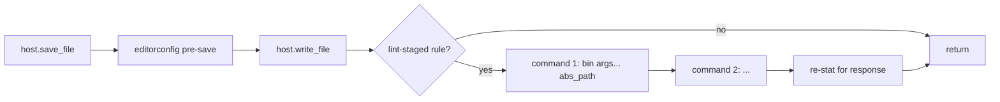

# ADR 0013 — Format on save: file-based lint-staged invocation

Date: 2026-05-07
Status: accepted; supersedes [ADR 0012 § stdin/stdout invocation](0012-format-on-save.md#stdinstdout-invocation), [§ First-match reduction](0012-format-on-save.md#first-match-reduction), and the `KnownTool` allow-list it depended on.

## Context

[ADR 0012](0012-format-on-save.md) wired format-on-save through a
stdin/stdout pipeline: `LocalHost::save_file` parsed the lint-staged
command, looked up the binary in a hard-coded `KnownTool` table
(`oxfmt` / `prettier` / `rustfmt`), stripped file-mutation flags
(`--write`, `-w`, `--check`, `--list-different`), and translated the
invocation to its stdin-mode equivalent (`--stdin-filepath=<abs>` for
oxfmt / `--stdin-filepath <abs>` for prettier / `--emit stdout` for
rustfmt). For chains, only the first command ran.

The architecture worked but constrained the team's lint-staged config:

1. **Allow-list lock-in.** Anything outside `oxfmt` / `prettier` /
   `rustfmt` skipped silently with a `tracing::warn!`. The team's
   `moon-landing/server/package.json` ships
   ```json
   "lint-staged": {
       "*.{js,mjs,ts,svelte}": [
           "node scripts/lint.ts --fix",
           "prettier -w --ignore-path ../.prettierignore"
       ]
   }
   ```
   `node scripts/lint.ts --fix` doesn't translate to a stdin-mode
   invocation (it expects file-path positional args), so it logged
   `format-on-save: unsupported tool; skipping tool="node"` and
   nothing ran.
2. **First-command-only.** Chains skipped to the first command and
   warned. Even if `node` had been supported, the `prettier -w` step
   would never have run because it's the second command. So the user
   saw `format-on-save: only the first command in a lint-staged chain
runs pattern=*.{js,mjs,ts,svelte} count=2` plus the unsupported
   warning above; no formatter ran on save.
3. **Per-tool flag rewriting was the entire reason the allow-list
   existed.** Each entry in `KnownTool` contributed a tiny argv
   translation table: where to put `--stdin-filepath`, which mode flags
   to strip, whether `--emit stdout` was needed. Adding `eslint` /
   `biome` / a custom script meant authoring another row.

The user surfaced both warnings on 2026-05-07 and asked, fairly,
whether we could just run all the tools in the chain instead.

## Decision

**Run lint-staged commands the way `bun run lint-staged` itself does on
commit.** Spawn the user's binary with the user's args verbatim, append
the absolute file path as the last positional argument, let the tool
mutate the file in place. Drop the `KnownTool` allow-list, drop the
mode-flag stripping, drop the stdin/stdout plumbing.

### Chain-truncation caveat (current state, 2026-05-07)

The intended end state is "run every command in the matched chain in
order". The current implementation in `LocalHost::run_formatter_chain`
ships a deliberately-narrowed version: **only the last command in the
chain runs** when the chain has more than one entry. That keeps
moon-landing's `*.{js,mjs,ts,svelte}` chain
(`node scripts/lint.ts --fix`, then `prettier -w`) usable on every
save: `prettier -w` runs, the slow `node` script doesn't. A
`tracing::warn!` deduped per chain length fires once per process so
the deviation is visible in logs.

Flipping back to "run the whole chain" is a small change in
`run_formatter_chain` plus a test rename — tracked by the explicit
TODO in that function. The trigger is moon-landing's lint script
becoming fast enough to live in a save-time pipeline.

Single-command rules (the team's `.lintstagedrc.json` for the moon-ide
repo itself, every other format-only entry) are unaffected: chain
length 1 means nothing to truncate.

When the flip happens it diverges from `bun run lint-staged`'s
commit-time behaviour in one specific way: **chains do not abort on the
first non-zero exit / timeout / spawn error.** Every command in the
chain runs regardless of earlier failures. The rationale is that
format-on-save is best-effort by design — if `eslint --fix` times out,
we still want `prettier -w` to run on the file the user is saving. The
same disposition we already apply to a single failing command (log,
keep the editorconfig-normalised bytes) extends naturally to chains:
each command's failure logs its own `tracing::warn!`; subsequent
commands keep going. lint-staged's commit-time abort-on-failure makes
sense for "block the commit until the team fixes it"; save-time has no
commit to block, so the cost of stopping mid-chain is "the team's
formatter doesn't run because something else failed first", which is
worse than "two warnings instead of one in the dev log".

### New flow



The editorconfig pre-save pass (line endings → trim trailing ws → final
newline) still runs first so the formatter has coherent bytes to read
even when no formatter is configured. For files a formatter owns the
editorconfig pass is essentially redundant (oxfmt / prettier / rustfmt
all canonicalise the same things) but it's a cheap in-memory transform
and it keeps a single code path for both branches.

### Why "trust the user's argv verbatim" is fine

| Claim                                               | Why it holds                                                                                                                                                                                                                                     |
| --------------------------------------------------- | ------------------------------------------------------------------------------------------------------------------------------------------------------------------------------------------------------------------------------------------------ |
| `prettier -w` mutates the file.                     | Yes — that's exactly what we want. The old design stripped `-w` only because `--stdin-filepath` rejects it. With the file argument, `-w` is necessary for prettier to actually write.                                                            |
| `prettier --check` becomes a no-op on save.         | Yes, but that's the user telling lint-staged "check don't write" — same no-op happens on `bun run lint-staged`. The team's actual configs all use `-w` / `--write` / `--fix` / equivalent.                                                       |
| `node scripts/lint.ts --fix path/to/file.ts` works. | Same argv shape lint-staged uses on commit.                                                                                                                                                                                                      |
| Chains run in order.                                | Each command sees the previous one's output via the on-disk bytes. Same behaviour as commit-time `lint-staged`.                                                                                                                                  |
| Concurrent in-flight saves.                         | `save_file` is sequential per file from the editor's POV (it's a single IPC call that returns when the chain finishes). The pre-existing buffer-fingerprint check in the editor handles "user typed more during the IPC roundtrip". No new race. |
| Cursor preservation.                                | Editor still re-reads after save and applies bytes as a single buffer update; CodeMirror handles the diff exactly as it did under the stdin/stdout design.                                                                                       |
| File-watcher noise.                                 | Phase 1.5 has no fs watcher yet; this is a Phase 5 concern. When the watcher arrives, "ignore changes I just wrote myself" gating handles it for both single writes and chain mutations.                                                         |

### Project-local binary discovery

Instead of a per-tool `prefers_node_modules` flag walked from the file
upward, the spawned subprocess gets an enriched `PATH`: every
`node_modules/.bin/` from `config_dir` up to `workspace_root` is
prepended to the inherited `PATH`. Same convention `npm-run-path` /
lint-staged itself use. Effects:

- Locally-installed `prettier` / `eslint` / `biome` / `oxfmt` resolve
  before any system installation.
- System tools (`node`, `bun`, `python`, `rustfmt` from rustup) fall
  through to system `PATH` because they aren't in `node_modules/.bin/`.
- We don't have to know which tool is which.

### Failure modes

Format-on-save is best-effort by design (`save_file` must always land
the bytes). Any of these collapses to a `tracing::warn!` and the chain
either aborts (for `failed` commands inside the chain) or skips
(when nothing matched):

- **Binary not found.** `Command::spawn` returns `ErrorKind::NotFound`.
  Logged once per tool name (deduped per process) as
  `format-on-save: tool not found in node_modules/.bin or $PATH; skipping`.
- **Non-zero exit.** Logged with the tool name, exit status, and a
  trimmed `stderr`. Chain aborts; subsequent commands don't run.
- **Spawn error other than NotFound.** Logged with the underlying
  `io::Error`. Chain aborts.
- **5-second timeout.** Hardcoded; logged with the tool name. Chain
  aborts.

The editorconfig pre-save pass already wrote bytes to disk before any
of this fired, so the worst-case file state is "editorconfig-normalised
but unformatted" or "partially formatted up to the failing command",
both of which are recoverable on the next save.

### What goes away

- `KnownTool` enum, `from_bin_name`, `binary_name`, `prefers_node_modules`.
- `is_mode_flag` (and its `--write` / `-w` / `--check` / `-l` table).
- `KnownTool::build_argv` (the per-tool stdin-argv translation).
- `resolve_binary` + `find_node_modules_bin` (replaced by PATH-prepend).
- `LintStagedRules::match_command` (singular, returned the first command
  of the first match) — replaced by `match_commands` (plural, returns
  the whole chain). The host caller is responsible for chain-handling
  policy (today: "run only the last", per the caveat above).
- The `format-on-save: only the first command in a lint-staged chain
runs` warning (which fired on the team's `moon-landing/server` config).
  Replaced by a deduped
  `format-on-save: lint-staged chain truncated to last command` warning
  while the truncation caveat is in force.
- The `format-on-save: unsupported tool; skipping` warning (now an
  unreachable case — every command is "supported" because there's no
  allow-list).
- `KnownTool::build_argv` unit tests.

### What stays

- `.lintstagedrc.json` / `package.json#lint-staged` is still the
  source of truth. JSON-only. Closest-config-wins. Per-directory cache
  invalidated on save of `.lintstagedrc.json` / `package.json`.
- The 5s timeout, the deduped warnings.
- `WorkspaceHost::save_file` is still the single seam; `write_file`
  still keeps its raw-bytes meaning.
- `WorkspaceHost::lint_staged_for` keeps its trait surface
  (`LintStagedRules`); only `match_command` rotated to `match_commands`.
- The trait-level "failures never abort the save" contract.

## Consequences

- Team configs that lint-staged itself accepts also work in moon-ide on
  save. The two warnings the user reported stop firing. Save-time and
  commit-time produce the same bytes.
- The pipeline's atomicity changes shape: previously the formatter was
  one in-memory string transform before a single disk write; now it's
  a write + a chain of subprocess mutations. On a healthy install this
  is sub-100ms (each subprocess-spawn dominates the wall time, not the
  IO). Failure leaves a partially-formatted file on disk, mirroring
  lint-staged's commit-time behaviour exactly — same recovery story
  (next save retries).
- Per-tool knowledge moves out of moon-ide and into the team's
  lint-staged map, which is the same place all our other "what runs on
  this filetype" decisions already live (CI, pre-commit, IDE).
- Adding new formatters to a workspace stops needing a moon-ide change.

## Out of scope

- A "format on save" toggle. Still hardcoded on, per AGENTS.md
  "hardcode first, configure later".
- Per-language formatter UI. Still lint-staged's map.
- Lint-on-save (oxlint, clippy). Still Phase 8.
- Quoted-argument support in lint-staged commands (no team config uses
  one yet; whitespace split keeps the dependency surface minimal).
- File-watcher integration (Phase 5).
