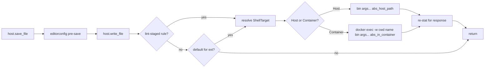

# ADR 0013 — Format on save: file-based lint-staged invocation

Date: 2026-05-07
Status: accepted; supersedes [ADR 0012 § stdin/stdout invocation](0012-format-on-save.md#stdinstdout-invocation), [§ First-match reduction](0012-format-on-save.md#first-match-reduction), and the `KnownTool` allow-list it depended on.

## Context

[ADR 0012](0012-format-on-save.md) wired format-on-save through a
stdin/stdout pipeline: `LocalHost::save_file` parsed the lint-staged
command, looked up the binary in a hard-coded `KnownTool` table
(`oxfmt` / `prettier` / `rustfmt`), stripped file-mutation flags
(`--write`, `-w`, `--check`, `--list-different`), and translated the
invocation to its stdin-mode equivalent (`--stdin-filepath=<abs>` for
oxfmt / `--stdin-filepath <abs>` for prettier / `--emit stdout` for
rustfmt). For chains, only the first command ran.

The architecture worked but constrained the team's lint-staged config:

1. **Allow-list lock-in.** Anything outside `oxfmt` / `prettier` /
   `rustfmt` skipped silently with a `tracing::warn!`. The team's
   `moon-landing/server/package.json` ships
   ```json
   "lint-staged": {
       "*.{js,mjs,ts,svelte}": [
           "node scripts/lint.ts --fix",
           "prettier -w --ignore-path ../.prettierignore"
       ]
   }
   ```
   `node scripts/lint.ts --fix` doesn't translate to a stdin-mode
   invocation (it expects file-path positional args), so it logged
   `format-on-save: unsupported tool; skipping tool="node"` and
   nothing ran.
2. **First-command-only.** Chains skipped to the first command and
   warned. Even if `node` had been supported, the `prettier -w` step
   would never have run because it's the second command. So the user
   saw `format-on-save: only the first command in a lint-staged chain
runs pattern=*.{js,mjs,ts,svelte} count=2` plus the unsupported
   warning above; no formatter ran on save.
3. **Per-tool flag rewriting was the entire reason the allow-list
   existed.** Each entry in `KnownTool` contributed a tiny argv
   translation table: where to put `--stdin-filepath`, which mode flags
   to strip, whether `--emit stdout` was needed. Adding `eslint` /
   `biome` / a custom script meant authoring another row.

The user surfaced both warnings on 2026-05-07 and asked, fairly,
whether we could just run all the tools in the chain instead.

## Decision

**Run lint-staged commands the way `bun run lint-staged` itself does on
commit.** Spawn the user's binary with the user's args verbatim, append
the absolute file path as the last positional argument, let the tool
mutate the file in place. Drop the `KnownTool` allow-list, drop the
mode-flag stripping, drop the stdin/stdout plumbing.

### Container routing (added 2026-05-07)

Format-on-save shells out to a binary that's expected to mutate the
file in place. moon-ide runs on the host even when the active folder
is bind-mounted into the workspace shell container — so a host-side
spawn happens in the _wrong userland_: stable rustfmt instead of the
container's nightly, system-wide `prettier` instead of the project's
pinned one, the host's edition resolution instead of `Cargo.toml`'s.
This is exactly the situation [ADR 0002 — workspace host](0002-workspace-host.md)
exists to avoid; the LSP layer
([ADR 0007 / `specs/lsp.md` § container-backed LSP](../lsp.md))
and the agent's `bash` tool ([phase-06-coder.md](../roadmaps/phase-06-coder.md))
already route through the container the same way.

[`moon_core::shell::ShellTarget`](../../crates/moon-core/src/shell.rs)
unifies the spawn boundary:

- `ShellTarget::Host` → `Command::new(bin)` with the existing
  `node_modules/.bin/`-walking `PATH` prefix.
- `ShellTarget::Container { container_name, host_root, server_root }`
  → `docker exec -w <container_cwd> <name> <bin> <args> <abs_in_container>`.
  Paths translate through the bind mount (`/workspace/<basename>/...`)
  the same way [`TerminalTarget::container_cwd_for_folder`](../../crates/moon-terminal/src/target.rs)
  resolves them for terminals; if the file isn't under the mount the
  formatter silently no-ops with a `tracing::warn!`. No `-it`: format-
  on-save wants captured output, not a TTY (same shape the agent's
  `bash` tool uses, and the inverse of LSP's `-i` only — LSP needs
  stdin open for JSON-RPC).

A [`ShellResolver`](../../crates/moon-core/src/shell.rs) trait sits in
`moon-core` so the format pipeline doesn't depend on `moon-container`
or docker. `WorkspaceRegistry` carries an `OnceLock<ShellResolverHandle>`
that gets installed once at startup; every `LocalHost::new` built
afterwards picks it up. The Tauri-side implementation lives in
[`src-tauri/src/shell_resolver.rs`](../../src-tauri/src/shell_resolver.rs)
and mirrors `commands::lsp::resolve_target` /
`moon_coder::tools::resolve_bash_target` line-for-line: build a
`ContainerWorkspace` from the current bound-folder set, query its
lifecycle status, return `Container` only when the project is
`Running`. Any failure (no compose project, daemon unreachable, parse
error) collapses to `Host` — format-on-save is best-effort and a
container hiccup must never make it worse than the host-only baseline.

A future cleanup can collapse the three `resolve_*_target` copies (LSP
broker, coder bash, format-on-save) into the same trait. The current
duplication is intentional: each layer grew the routing inline at a
different time, and consolidating them is its own change.

#### Project-local binary discovery in the container (added 2026-05-07)

Initial container support deferred `node_modules/.bin/` discovery: the
container image was responsible for `PATH`, and `--env PATH=…` was off
the table because docker's `--env` _replaces_ the in-container `PATH`
(it would have lost the rustup / fnm / bun / system bins moon-base
sets up). The first project the team actually saved to in container
mode — `~/code/moon-landing/server`, lint-staged's
`prettier -w --ignore-path ../.prettierignore` — surfaced the gap:
`prettier` lives in the workspace's `node_modules/.bin/`, not on the
container's `PATH`, so the spawn failed with `NotFound` and no
formatter ran. Format-on-save worked on the host (the npm-run-path
chain prepend is on `Command::env`) and silently no-op'd in container.

The fix wraps the docker exec in a `sh -c` that prepends the project's
in-container `node_modules/.bin/` chain (host paths translated through
the bind mount) to the container's existing `$PATH`, then `exec "$@"`s
the original argv. Concretely:

```
docker exec -w <container_cwd> <name>
  sh -c 'PATH="<chain>:$PATH" exec "$@"'
  sh <bin> <user_args>... <abs_in_container>
```

The shell expands `$PATH` at exec time inside the container, so we
keep whatever moon-base configured (rustup, fnm's default Node, bun,
uv, system bins) without having to know the layout. `sh` is the
conventional `$0` placeholder; the formatter inherits the original
argv via `"$@"` with no extra quoting. Same `npm-run-path` walk the
host arm uses (`config_dir` → `workspace_root`), just translated into
container space.

This does **not** activate the project's pinned Node version (e.g.
moon-landing's `.nvmrc` 24.14.1). `node` itself resolves to whatever
moon-base set as the fnm default (the container LTS), because fnm's
`--use-on-cd` hook only fires for interactive shells and `docker
exec` is non-interactive. For the format pipeline that's fine — the
formatter binaries (`prettier`, `oxfmt`, `eslint`, `ruff`) work on any
modern-enough Node, and the team isn't running native-module-bound
tooling at save time. If the team starts saving against a project
that needs the pinned Node at format time, add an `eval "$(fnm env)"
&& fnm use --install-if-missing --silent-if-unchanged` prelude to the
wrapper — same shape, two extra lines.

#### What this does NOT solve

- **Format-on-save running in `moon-remote`.** The remote sidecar grows
  its own `WorkspaceHost` impl in Phase 2; the same `ShellTarget` /
  `ShellResolver` machinery applies there, with a different resolver
  picking the in-sidecar shell. No change required to the format
  pipeline itself.
- **A truly different toolchain per bound folder.** If two folders
  bind into the same workspace shell with conflicting toolchains, the
  one moon-base ships wins. That's a workspace-shell concern, not a
  format-on-save one.

### Language-default fallback (added 2026-05-07)

lint-staged is the team's per-repo source of truth for _which_ tool runs
on save. Most of the team's projects ship a `.lintstagedrc.json` (or a
`package.json#lint-staged`) and that's the whole story. A few don't:
`~/code/workloads` is pure Rust + Cargo, has no JS toolchain, and the
team has no reason to add lint-staged just to wire format-on-save.
Telling each Rust-only repo "drop a `.lintstagedrc.json` even though
nothing else uses it" is the kind of dead config the bootstrap rule
([ADR 0005](0005-bootstrap.md)) tells us to avoid.

`LocalHost::run_formatter_chain` therefore has two layers:

1. **lint-staged** wins whenever it has a matching rule for the file.
   Identical behaviour to "before" — the team's `.lintstagedrc.json`
   stays the source of truth wherever it exists.
2. **Language-default formatter**, looked up by file extension in
   [`format::default_format_command`], fires only when (1) didn't apply
   (no config in the workspace, or a config that doesn't list the
   file's extension).

Today's table:

| extension      | command (base)            | cwd                  |
| -------------- | ------------------------- | -------------------- |
| `.rs`          | `rustfmt --edition <e>`   | file's parent dir    |
| `.py` / `.pyi` | `[.venv/bin/]ruff format` | nearest project root |
| `.go`          | `gofmt -w`                | file's parent dir    |

The resolver also returns the `cwd` the subprocess should run in,
not just the command — necessary because Python's project-local
toolchain (`.venv/bin/ruff`) only resolves when the subprocess is
spawned with the project root as its working directory. The Rust
path keeps the existing "file's parent" cwd; the Python path pins
to the project root.

`rustfmt` walks up from each input file looking for `rustfmt.toml` /
`.rustfmt.toml`. The edition we have to discover ourselves: bare
`rustfmt <file>` defaults to **edition 2015** because rustfmt only
reads `Cargo.toml` for the edition when invoked through `cargo fmt`.
Edition 2015 rejects `async fn`, `let-else`, every modern Rust
feature — so without `--edition` the fallback fails on every
realistic crate.

The Rust path therefore walks parents from the file looking for the
nearest `Cargo.toml` whose `[package]` table declares an `edition`
(workspace-only manifests are skipped because rustfmt operates per
crate). Detected edition is forwarded as `--edition <value>`. When
no `Cargo.toml` matches we default to `2024` — modern projects pick
up the right edition, older crates with `edition = "2018"` declared
explicitly still work, and the only loser is a hypothetical edition-
2015-only crate without a `[package].edition` line, which would fall
through to today's defaults anyway.

`cargo fmt` was the obvious alternative — it handles edition lookup
itself — but it formats the _whole package_ per call, so saving one
file would reformat every other dirty file in the same crate.
Per-file formatting matters because the editor's "the file you
saved looks different from what you saved" UX hinges on it.

The subprocess runs with the file's parent directory as `cwd`,
matching what a shell invocation from that directory would resolve.
When `rustfmt` isn't installed the existing "tool not found" warning
fires and the file keeps its editorconfig-normalised bytes.

#### Python: ruff with venv preference

The Python path walks parents from the file looking for the first
directory containing `pyproject.toml`, `setup.py`, or `setup.cfg`
— the canonical Python project markers. That directory becomes
both the project root and the subprocess `cwd`, so:

- `ruff` finds the project's `[tool.ruff]` config (it walks up
  from cwd, same as it does in a shell).
- A relative `.venv/bin/ruff` bin token resolves correctly from
  cwd. When `<root>/.venv/bin/ruff` exists on the host filesystem
  we prefer it over a bare `ruff` PATH lookup. Projects pin
  specific ruff versions in their venv (`uv pip install ruff` /
  `pip install ruff==X`); honouring that pin matches what the
  team would get running `ruff format` from a terminal in the
  same directory.
- The same string works on host **and** container with no
  bin-token translation. The bind mount makes
  `<host>/.venv/bin/ruff` and `/workspace/<basename>/.venv/bin/ruff`
  the same inode, so the host-side `is_file()` probe is correct
  for either target. `docker exec -w <translated_cwd> …
.venv/bin/ruff format <translated_abs_path>` then resolves the
  bin against the in-container cwd just like `Command::new("…")
.current_dir(…)` does on the host.

When no project marker is found anywhere up the tree (a loose
`.py` script in a notes directory, a snippet inside a README's
adjacent dir) the resolver falls back to the file's parent dir as
cwd and bare `ruff format`. ruff's defaults still produce a
useful format; the only thing missing is project-specific config.

#### Go: gofmt

The Go path is the simplest of the three: `gofmt -w <file>`
reformats in place. `gofmt` ships with the Go toolchain itself
(no extra install), is opinionated by design (no project
`.gofmt.toml` or equivalent to read), and runs per-file — same
shape as rustfmt. We pin `cwd` to the file's parent directory;
`gofmt` has no notion of a project root.

`goimports` would have been the obvious richer alternative — it
formats _and_ organises imports — but it requires a separate
install (`go install golang.org/x/tools/cmd/goimports@latest`)
that we don't want to assume yet. Per the hardcode-first rule,
gofmt covers the common case; teams that ship `goimports`-ed
code via lint-staged keep their existing pipeline (lint-staged
always wins).

`black` and `autopep8` aren't in the table. The hardcode-first
rule lets the team add them when a project that uses them lands
on the format-on-save path; until then, ruff is the default
because every Python project the team works on (`huggingface_hub`,
internal tooling) ships a ruff-shaped pipeline. As elsewhere,
lint-staged still wins whenever a `.lintstagedrc.json` matches
the file, so a black-using project that ships
`{ "*.py": "black" }` overrides the default the same way it does
for everything else.

#### Why a struct, not just a string

`default_format_command` returns a `DefaultFormatCommand { command,
cwd }` rather than a bare command string. Splitting `cwd` out of
the resolver's contract is what makes the relative-bin-token trick
work for Python without leaking any container-awareness into the
format module — every other case (Rust today, hypothetical Go /
JS / etc. tomorrow) just sets `cwd` to the file's parent and
keeps the existing semantics. The host runner forwards the cwd
verbatim; the container runner translates it through the bind
mount the same way it always did.

#### Adding a row

Per AGENTS.md "hardcode first, configure later" we add a row when a
project the team uses needs one. The table is **not** an allow-list:
adding a row never overrides an explicit lint-staged config (lint-staged
matches first). Removing a row stops the fallback for that extension
without affecting any team config.

### Chain semantics (current state, 2026-05-18)

`LocalHost::run_lint_staged_chain_for` runs **every** command in the
matched chain in order. Each command sees the previous one's output via
the on-disk bytes — same shape `bun run lint-staged` itself uses on
commit. moon-landing's `*.{js,mjs,ts,svelte}` chain
(`node scripts/lint.ts --fix`, then `prettier -w`) now runs both steps
on save, the way the team's commit pipeline already does.

The earlier shipping behaviour ("only the last command runs", with a
deduped truncation warning) is gone. It was a deliberately-narrow
workaround for `moon-landing/server`'s slow `node scripts/lint.ts`
step at format-on-save time; once the team's chains became fast enough
to live in the save pipeline, keeping the workaround was strictly
worse — chains with `eslint --fix` paired with `prettier -w` only ran
the formatter and silently dropped the linter step.

Chains diverge from `bun run lint-staged`'s commit-time behaviour in
one specific way: **save-time chains do not abort on the first non-zero
exit / timeout / spawn error.** Every command in the chain runs
regardless of earlier failures. The rationale is that format-on-save is
best-effort by design — if `eslint --fix` times out, we still want
`prettier -w` to run on the file the user is saving. The same
disposition we already apply to a single failing command (log, keep
the editorconfig-normalised bytes) extends naturally to chains: each
command's failure logs its own `tracing::warn!`; subsequent commands
keep going. lint-staged's commit-time abort-on-failure makes sense for
"block the commit until the team fixes it"; save-time has no commit to
block, so the cost of stopping mid-chain is "the team's formatter
doesn't run because something else failed first", which is worse than
"two warnings instead of one in the dev log".

Single-command rules (chain length 1) are unaffected — the loop just
runs once.

### New flow



The editorconfig pre-save pass (line endings → trim trailing ws → final
newline) still runs first so the formatter has coherent bytes to read
even when no formatter is configured. For files a formatter owns the
editorconfig pass is essentially redundant (oxfmt / prettier / rustfmt
all canonicalise the same things) but it's a cheap in-memory transform
and it keeps a single code path for both branches.

### Why "trust the user's argv verbatim" is fine

| Claim                                               | Why it holds                                                                                                                                                                                                                                     |
| --------------------------------------------------- | ------------------------------------------------------------------------------------------------------------------------------------------------------------------------------------------------------------------------------------------------ |
| `prettier -w` mutates the file.                     | Yes — that's exactly what we want. The old design stripped `-w` only because `--stdin-filepath` rejects it. With the file argument, `-w` is necessary for prettier to actually write.                                                            |
| `prettier --check` becomes a no-op on save.         | Yes, but that's the user telling lint-staged "check don't write" — same no-op happens on `bun run lint-staged`. The team's actual configs all use `-w` / `--write` / `--fix` / equivalent.                                                       |
| `node scripts/lint.ts --fix path/to/file.ts` works. | Same argv shape lint-staged uses on commit.                                                                                                                                                                                                      |
| Chains run in order.                                | Each command sees the previous one's output via the on-disk bytes. Same behaviour as commit-time `lint-staged`.                                                                                                                                  |
| Concurrent in-flight saves.                         | `save_file` is sequential per file from the editor's POV (it's a single IPC call that returns when the chain finishes). The pre-existing buffer-fingerprint check in the editor handles "user typed more during the IPC roundtrip". No new race. |
| Cursor preservation.                                | Editor still re-reads after save and applies bytes as a single buffer update; CodeMirror handles the diff exactly as it did under the stdin/stdout design.                                                                                       |
| File-watcher noise.                                 | Phase 1.5 has no fs watcher yet; this is a Phase 5 concern. When the watcher arrives, "ignore changes I just wrote myself" gating handles it for both single writes and chain mutations.                                                         |

### Project-local binary discovery

Instead of a per-tool `prefers_node_modules` flag walked from the file
upward, the spawned subprocess gets an enriched `PATH`: every
`node_modules/.bin/` from `config_dir` up to `workspace_root` is
prepended to the inherited `PATH`. Same convention `npm-run-path` /
lint-staged itself use. Effects:

- Locally-installed `prettier` / `eslint` / `biome` / `oxfmt` resolve
  before any system installation.
- System tools (`node`, `bun`, `python`, `rustfmt` from rustup) fall
  through to system `PATH` because they aren't in `node_modules/.bin/`.
- We don't have to know which tool is which.

### Failure modes

Format-on-save is best-effort by design (`save_file` must always land
the bytes). Any of these collapses to a `tracing::warn!` and the chain
**continues** to the next command (see § Chain semantics above for the
rationale); when nothing matched the chain is skipped entirely:

- **Binary not found.** `Command::spawn` returns `ErrorKind::NotFound`.
  Logged once per tool name (deduped per process) as
  `format-on-save: tool not found in node_modules/.bin or $PATH; skipping`.
  Next command in the chain still spawns.
- **Non-zero exit.** Logged with the tool name, exit status, and a
  trimmed `stderr`. Next command in the chain still spawns.
- **Spawn error other than NotFound.** Logged with the underlying
  `io::Error`. Next command in the chain still spawns.
- **5-second timeout.** Hardcoded; logged with the tool name. Next
  command in the chain still spawns.

The editorconfig pre-save pass already wrote bytes to disk before any
of this fired, so the worst-case file state is "editorconfig-normalised
but unformatted" or "partially formatted up to the failing command",
both of which are recoverable on the next save.

### What goes away

- `KnownTool` enum, `from_bin_name`, `binary_name`, `prefers_node_modules`.
- `is_mode_flag` (and its `--write` / `-w` / `--check` / `-l` table).
- `KnownTool::build_argv` (the per-tool stdin-argv translation).
- `resolve_binary` + `find_node_modules_bin` (replaced by PATH-prepend).
- `LintStagedRules::match_command` (singular, returned the first command
  of the first match) — replaced by `match_commands` (plural, returns
  the whole chain). The host caller runs every command in order, never
  aborting on failure (see § Chain semantics).
- The `format-on-save: only the first command in a lint-staged chain
runs` warning (which fired on the team's `moon-landing/server` config),
  along with the later `format-on-save: lint-staged chain truncated to
last command` warning that briefly replaced it. The chain runs in full
  now; both are unreachable.
- The `format-on-save: unsupported tool; skipping` warning (now an
  unreachable case — every command is "supported" because there's no
  allow-list).
- `KnownTool::build_argv` unit tests.

### What stays

- `.lintstagedrc.json` / `package.json#lint-staged` is still the
  source of truth. JSON-only. Closest-config-wins. Per-directory cache
  invalidated on save of `.lintstagedrc.json` / `package.json`.
- The 5s timeout, the deduped warnings.
- `WorkspaceHost::save_file` is still the single seam; `write_file`
  still keeps its raw-bytes meaning.
- `WorkspaceHost::lint_staged_for` keeps its trait surface
  (`LintStagedRules`); only `match_command` rotated to `match_commands`.
- The trait-level "failures never abort the save" contract.

## Consequences

- Team configs that lint-staged itself accepts also work in moon-ide on
  save. The two warnings the user reported stop firing. Save-time and
  commit-time produce the same bytes.
- The pipeline's atomicity changes shape: previously the formatter was
  one in-memory string transform before a single disk write; now it's
  a write + a chain of subprocess mutations. On a healthy install this
  is sub-100ms (each subprocess-spawn dominates the wall time, not the
  IO). Failure leaves a partially-formatted file on disk, mirroring
  lint-staged's commit-time behaviour exactly — same recovery story
  (next save retries).
- Per-tool knowledge moves out of moon-ide and into the team's
  lint-staged map, which is the same place all our other "what runs on
  this filetype" decisions already live (CI, pre-commit, IDE).
- Adding new formatters to a workspace stops needing a moon-ide change.

## Out of scope

- A "format on save" toggle. Still hardcoded on, per AGENTS.md
  "hardcode first, configure later".
- Per-language formatter UI. Still lint-staged's map.
- Lint-on-save (oxlint, clippy). Still Phase 8.
- Quoted-argument support in lint-staged commands (no team config uses
  one yet; whitespace split keeps the dependency surface minimal).
- File-watcher integration (Phase 5).
